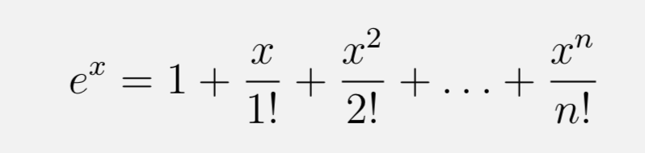
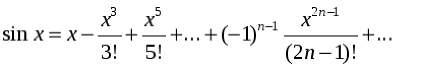
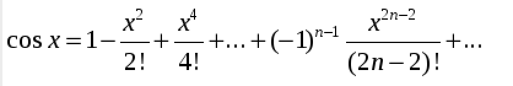
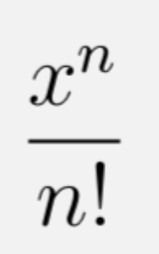

# ADS-2 Реализация численных методов для трансцедентных функций


Срок выполнения задания:

**до 06.03.22** 


## Задание

> Написать реализацию суммирования членов ряда для вычисления тренсцедентных функций

**Состав проекта**

```C++
   - double pown(double value, uint16_t n) - возведение числа в целую степень.
   - uint64_t fact(uint16_t n) - вычисление факториала чила n.
   - double calcItem(double x, uint16_t n) - вычисление члена ряда.
   - double expn(double x, uint16_t count) - вычисление значения функции exp(x) с суммированием count - членов ряда.
   - double sinn(double x, uint16_t count) - вычисление значения функции sin(x) с суммированием count - членов ряда.
   - double cosn(double x, uint16_t count) - вычисление значения функции cos(x) с суммированием count - членов ряда.   
 ```

## Пояснение

Для того, чтобы вычислить значения некоторых тренсцедентных функций (**exp**, **sin**, **cos**) применяется разложение в ряд:





Задача состоит в том, чтобы реализовать вычисление функций с определенной точностью, определяемой числом слагаемых (чем больше, тем точнее).

- **pown(value,n)** - функция возведения **value** в степень **n**.
- **fact** - вычисление факториала.
- **calcItem(x, n)** - вычисление слагаемого ряда 



Остальные функции вычисляют значения **exp, sin, cos**, суммируя **count** - членов ряда. Чем больше **count**, тем точнее расчет. 


Функции должны располагаться в файле **src/alg.cpp**.
